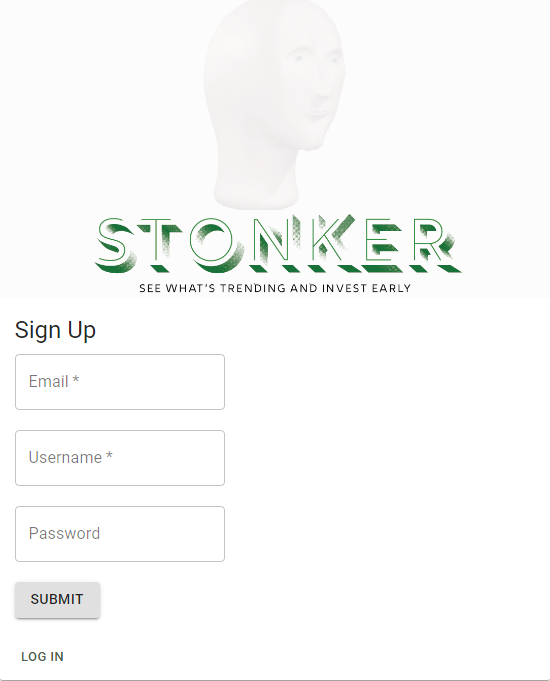
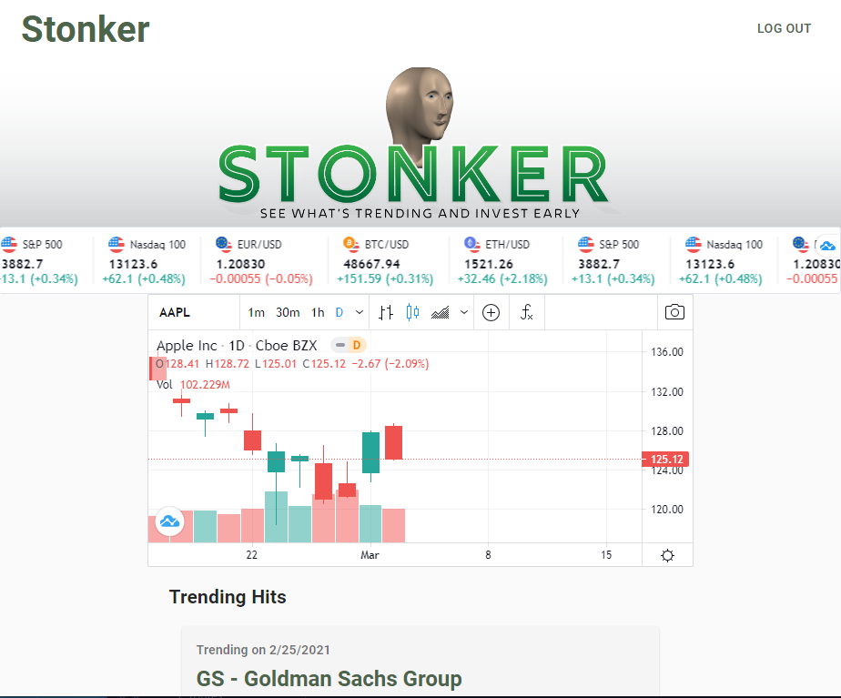
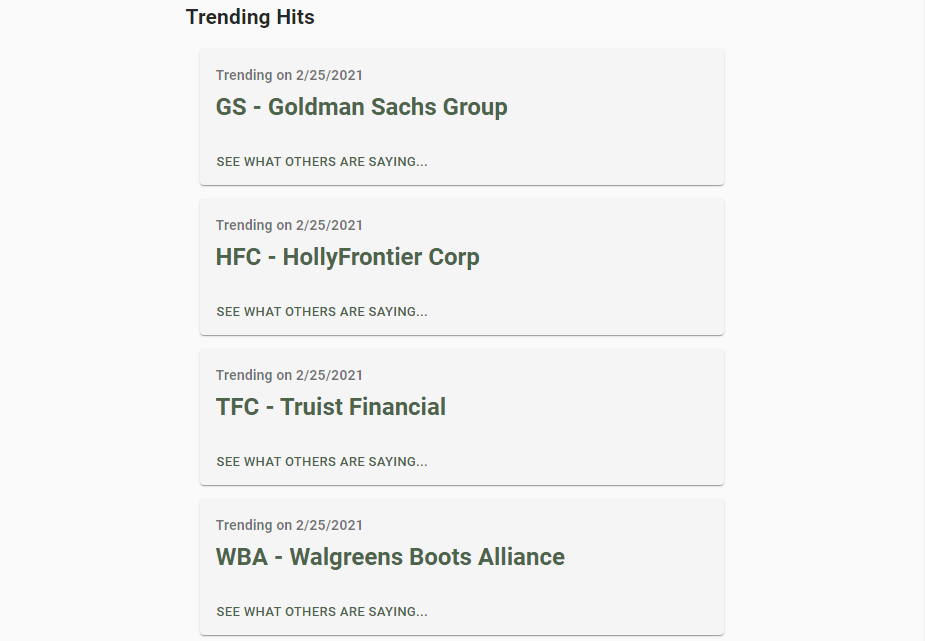

# Stonker

Stonker is a react app that gathers google trends data for stock market symbols and alerts users to potential market activity

### User Story 

Users may be in the market to purchase stocks and want a leg up on whats trending in the market without dealing with an investment banker.

## Table of Contents

- [Screenshots](#Screenshots)
- [License](#License)
- [Links](#Links)
- [Technologies](#Technologies)
- [Credits](#Credits)

## Screenshots

### Signup

### Login

### Homepage

### Hits

## License

MIT

## Links

* Repo: https://github.com/Henryrjung/stonker
* Deployed: https://stonkerapp.herokuapp.com/

## Technologies

* Material-UI - CSS
* MySQL
* Sequelize
* Passport
* React
* Google-Trends-API
* Node-cron
* JavaScript
* Node Modules

## Credits

* Paul Kirkpatrick
* Kaylee Horner
* Matt Pewewardy
* Henry Jung

* TA: Travis Morris
